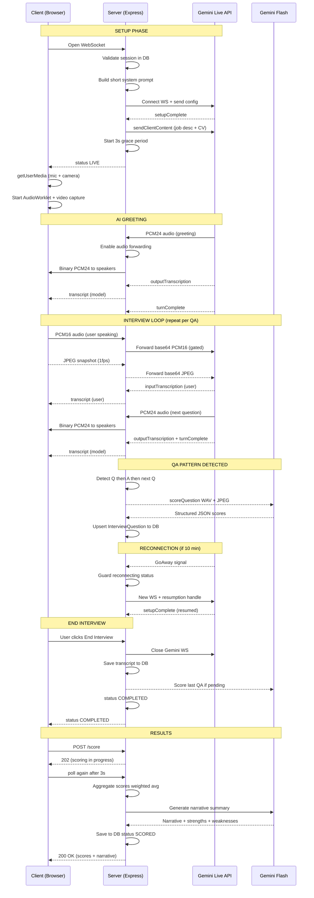

# Interview Session — Sequence Diagram

```mermaid
sequenceDiagram
    participant C as Client (Browser)
    participant S as Server (Express)
    participant G as Gemini Live API
    participant F as Gemini Flash

    Note over C,G: SETUP PHASE

    C->>S: Open WebSocket
    S->>S: Validate session in DB
    S->>S: Build short system prompt
    S->>G: Connect WS + send config
    G-->>S: setupComplete
    S->>G: sendClientContent (job desc + CV)
    S->>S: Start 3s grace period
    S-->>C: status LIVE
    C->>C: getUserMedia (mic + camera)
    C->>C: Start AudioWorklet + video capture

    Note over C,G: AI GREETING

    G->>S: PCM24 audio (greeting)
    S->>S: Enable audio forwarding
    S->>C: Binary PCM24 to speakers
    G-->>S: outputTranscription
    S-->>C: transcript (model)
    G-->>S: turnComplete

    Note over C,F: INTERVIEW LOOP (repeat per QA)

    C->>S: PCM16 audio (user speaking)
    S->>G: Forward base64 PCM16 (gated)
    C-->>S: JPEG snapshot (1fps)
    S-->>G: Forward base64 JPEG
    G-->>S: inputTranscription (user)
    S-->>C: transcript (user)
    G->>S: PCM24 audio (next question)
    S->>C: Binary PCM24 to speakers
    G-->>S: outputTranscription + turnComplete
    S-->>C: transcript (model)

    Note over S,F: QA PATTERN DETECTED

    S->>S: Detect Q then A then next Q
    S-->>F: scoreQuestion WAV + JPEG
    F-->>S: Structured JSON scores
    S->>S: Upsert InterviewQuestion to DB

    Note over S,G: RECONNECTION (if 10 min)

    G-->>S: GoAway signal
    S->>S: Guard reconnecting status
    S->>G: New WS + resumption handle
    G-->>S: setupComplete (resumed)

    Note over C,S: END INTERVIEW

    C->>S: User clicks End Interview
    S->>G: Close Gemini WS
    S->>S: Save transcript to DB
    S-->>F: Score last QA if pending
    S->>S: status COMPLETED
    S-->>C: status COMPLETED

    Note over C,F: RESULTS

    C->>S: POST /score
    S-->>C: 202 (scoring in progress)
    C->>S: poll again after 3s
    S->>S: Aggregate scores weighted avg
    S->>F: Generate narrative summary
    F-->>S: Narrative + strengths + weaknesses
    S->>S: Save to DB status SCORED
    S-->>C: 200 OK (scores + narrative)
```
